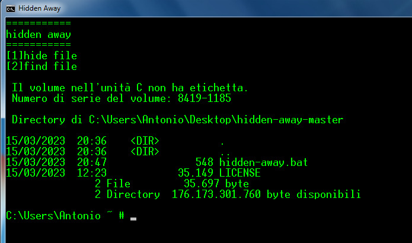

<h1 align="center"> Hidden Away <h1>

<p>
    
</p>

## 1. introduction

The hidden-away.bat software has been designed to simplify the process 
of hiding files on your Windows computer. The "h" attribute is used to 
hide a file or folder, making them invisible to users browsing through 
Windows Explorer. Additionally, the "h" attribute also protects files 
from the OS search process, preventing Windows from displaying them in 
search results.

With hidden-away.bat, modifying the "h" attribute becomes a breeze.With hidden-away.bat, changing the "h" attribute becomes child's play. just write the file name with its extension (if it's a folder just don't put the extension by pressing enter)

The process of hiding files becomes easy and convenient with hidden-away.bat. Additionally, the software has been designed to work on all Windows operating systems, ensuring greater flexibility and compatibility.

In conclusion, if you're looking for a simple and convenient way to hide files on your Windows computer, hidden-away.bat is the perfect software for you. Try it out today and discover how easy it can be to hide files with just a simple click of the mouse. Thank you for choosing hidden-away.bat!

## 2. Install

to make the program executable in any directory type this command with a root cmd (right click, run/open as administrator)

```batch
cp hidden-away.bat c:/windows/system32
```


## 3. Use

```batch
hidden-away.bat
```

just start the program on the folder where the file you want to hide/find is contained
